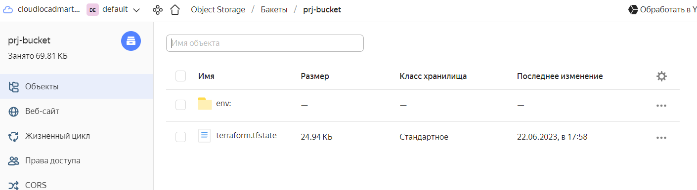
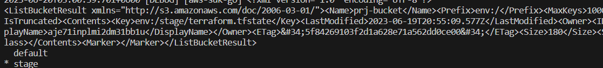
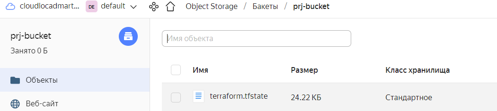
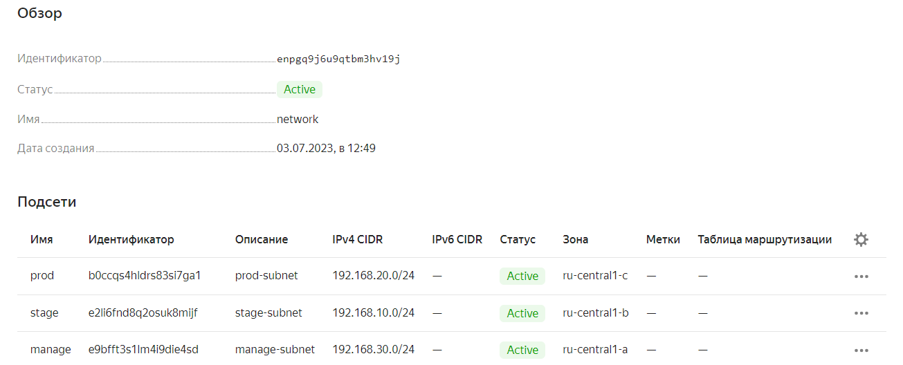
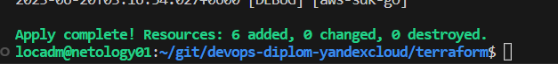
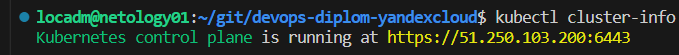
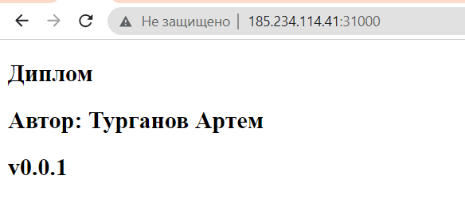

# Дипломный практикум в Yandex.Cloud
  * [Цели:](#цели)
  * [Этапы выполнения:](#этапы-выполнения)
     * [Создание облачной инфраструктуры](#создание-облачной-инфраструктуры)
     * [Создание Kubernetes кластера](#создание-kubernetes-кластера)
     * [Создание тестового приложения](#создание-тестового-приложения)
     * [Подготовка cистемы мониторинга и деплой приложения](#подготовка-cистемы-мониторинга-и-деплой-приложения)
     * [Установка и настройка CI/CD](#установка-и-настройка-cicd)
  * [Что необходимо для сдачи задания?](#что-необходимо-для-сдачи-задания)
  * [Как правильно задавать вопросы дипломному руководителю?](#как-правильно-задавать-вопросы-дипломному-руководителю)

---
## Цели:

1. Подготовить облачную инфраструктуру на базе облачного провайдера Яндекс.Облако.
2. Запустить и сконфигурировать Kubernetes кластер.
3. Установить и настроить систему мониторинга.
4. Настроить и автоматизировать сборку тестового приложения с использованием Docker-контейнеров.
5. Настроить CI для автоматической сборки и тестирования.
6. Настроить CD для автоматического развёртывания приложения.

---
## Создание облачной инфраструктуры
<details><summary> Задание </summary>

Для начала необходимо подготовить облачную инфраструктуру в ЯО при помощи [Terraform](https://www.terraform.io/).

Особенности выполнения:

- Бюджет купона ограничен, что следует иметь в виду при проектировании инфраструктуры и использовании ресурсов;
- Следует использовать последнюю стабильную версию [Terraform](https://www.terraform.io/).

Предварительная подготовка к установке и запуску Kubernetes кластера.

1. Создайте сервисный аккаунт, который будет в дальнейшем использоваться Terraform для работы с инфраструктурой с необходимыми и достаточными правами. Не стоит использовать права суперпользователя
2. Подготовьте [backend](https://www.terraform.io/docs/language/settings/backends/index.html) для Terraform:  
   а. Рекомендуемый вариант: [Terraform Cloud](https://app.terraform.io/)  
   б. Альтернативный вариант: S3 bucket в созданном ЯО аккаунте
3. Настройте [workspaces](https://www.terraform.io/docs/language/state/workspaces.html)  
   а. Рекомендуемый вариант: создайте два workspace: *stage* и *prod*. В случае выбора этого варианта все последующие шаги должны учитывать факт существования нескольких workspace.  
   б. Альтернативный вариант: используйте один workspace, назвав его *stage*. Пожалуйста, не используйте workspace, создаваемый Terraform-ом по-умолчанию (*default*).
4. Создайте VPC с подсетями в разных зонах доступности.
5. Убедитесь, что теперь вы можете выполнить команды `terraform destroy` и `terraform apply` без дополнительных ручных действий.
6. В случае использования [Terraform Cloud](https://app.terraform.io/) в качестве [backend](https://www.terraform.io/docs/language/settings/backends/index.html) убедитесь, что применение изменений успешно проходит, используя web-интерфейс Terraform cloud.
</details>

> Ожидаемые результаты:
>
> 1. Terraform сконфигурирован и создание инфраструктуры посредством Terraform возможно без дополнительных ручных действий.
> 2. Полученная конфигурация инфраструктуры является предварительной, поэтому в ходе дальнейшего выполнения задания возможны изменения.

### - Подход
Бюджет ограничен, поэтому на кластер выделю 3 машины (мастер, 2 ноды).
До окончания установки и освоения Куберсластера: 2 CPU 4 RAМ 30 GB, 2 CPU 2 RAМ 20GB
Далее с ростом загрузки кластера сервера повышаем вокеры до 2 CPU 4 RAМ 40 GB
На этапе построения мониторинга, CI/CD при необходимости добавлю 1/2 ноды под отдельностоящие, либо кластерные ноды.

### - Подготовка локальной машины
Работы будут проводится с локальной машины, обновим:
```
locadm@netology01:~/git/devops-diplom-yandexcloud$ yc version
Yandex Cloud CLI 0.108.1 linux/amd64

locadm@netology01:~/git/devops-diplom-yandexcloud$ terraform version
Terraform v1.5.0
on linux_amd64

locadm@netology01:~/git/devops-diplom-yandexcloud$ docker version
Client:
Version:           20.10.21

locadm@netology01:~/git/devops-diplom-yandexcloud$ ansible --version
ansible [core 2.12.10]
```
Независимые от машин процедуры. Создание бакета сервисного аккаунта в виде отдельной процедуры.

Сценарий:
* Создание системного аккаунта для доступа в бакет, роли, доступы


* Создание бакета

[bucket.tf](bucket/bucket.tf)

[bucket.sh](bucket/bucket.sh)




```
locadm@netology01:~/git/devops-diplom-yandexcloud$  yc iam service-account list
+----------------------+------+
|          ID          | NAME |
+----------------------+------+
| ajerrs1onub10uen31ir | sa   |
+----------------------+------+

locadm@netology01:~/git/devops-diplom-yandexcloud$ yc iam access-key list --service-account-name sa
+----------------------+----------------------+---------------------------+
|          ID          |  SERVICE ACCOUNT ID  |          KEY ID           |
+----------------------+----------------------+---------------------------+
| ajetem4nemg353e3kcm2 | ajerrs1onub10uen31ir | YCAJE5pEFCMnjD72-rcPSfUCZ |
+----------------------+----------------------+---------------------------+

locadm@netology01:~/git/devops-diplom-yandexcloud$ yc storage bucket list
+------------+----------------------+----------+-----------------------+---------------------+
|    NAME    |      FOLDER ID       | MAX SIZE | DEFAULT STORAGE CLASS |     CREATED AT      |
+------------+----------------------+----------+-----------------------+---------------------+
| prj-bucket | b1gkgthf18fqkuii66ht |        0 | STANDARD              | 2023-06-22 14:54:42 |
+------------+----------------------+----------+-----------------------+---------------------+
```

### - Подготовка инфры к минимальному кластеру k8s

Сценарий:

* Задаем workspaces по простой схеме default stage. Разварачиваем в Stage.
Текущий ws указывается в глобальном окружении tf

[enviroment](.terraform/environment)



* Задаем провадера и выбираем бекэнд S3 на базе 
Бэкенд сохраняет стейты в бакет Yandex.


* Генерируем и прокидываем ключи доступа на будующие машины
[keys.sh](k8s/keys.tf)
* Задаем сеть в три подсети [network.tf](k8s/network.tf)
stage prod manage (service)



* Установка машины (мастер/ноды) с прокидыванием внешний ключей для ansible 
[compute.tf](k8s/compute.tf)

* Преподготовка машин под кубер
   * Подготовка инвентаря для подключения ansible
   [pre_kubespray.tf](k8s/pre_kubespray.tf)
   * Плейбук подготовки в Kubspray 
      * Прокидывание внутренних ключей между нодами
      * Установка Python
      * Установка kubspray
      * Предподготовка конфигов Kubespray
         * Включение инвентаря с tf прошлого раздела
         * k8s-cluster.yml добавление supplementary_addresses_in_ssl_keys
         для внешнего доступа
      [kubespray](k8s/kubespray.yaml)

Проверяем apply/destoy



```
locadm@netology01:~/git/devops-diplom-yandexcloud$ yc compute instance list
+----------------------+-------------------+---------------+---------+----------------+---------------+
|          ID          |       NAME        |    ZONE ID    | STATUS  |  EXTERNAL IP   |  INTERNAL IP  |
+----------------------+-------------------+---------------+---------+----------------+---------------+
| epd1l398kq3224f0rcj1 | vm-stage-worker-1 | ru-central1-b | RUNNING | 84.252.139.87  | 192.168.10.17 |
| epdiish5p67373upmq23 | vm-stage-master   | ru-central1-b | RUNNING | 51.250.103.200 | 192.168.10.21 |
| epdplqs8daiqnr1kdenl | vm-stage-worker-0 | ru-central1-b | RUNNING | 51.250.28.121  | 192.168.10.13 |
+----------------------+-------------------+---------------+---------+----------------+---------------+
```

---
## Создание Kubernetes кластера
<details><summary> Задание </summary>
На этом этапе необходимо создать [Kubernetes](https://kubernetes.io/ru/docs/concepts/overview/what-is-kubernetes/) кластер на базе предварительно созданной инфраструктуры.   Требуется обеспечить доступ к ресурсам из Интернета.

Это можно сделать двумя способами:

1. Рекомендуемый вариант: самостоятельная установка Kubernetes кластера.  
   а. При помощи Terraform подготовить как минимум 3 виртуальных машины Compute Cloud для создания Kubernetes-кластера. Тип виртуальной машины следует выбрать самостоятельно с учётом требовании к производительности и стоимости. Если в дальнейшем поймете, что необходимо сменить тип инстанса, используйте Terraform для внесения изменений.  
   б. Подготовить [ansible](https://www.ansible.com/) конфигурации, можно воспользоваться, например [Kubespray](https://kubernetes.io/docs/setup/production-environment/tools/kubespray/)  
   в. Задеплоить Kubernetes на подготовленные ранее инстансы, в случае нехватки каких-либо ресурсов вы всегда можете создать их при помощи Terraform.
2. Альтернативный вариант: воспользуйтесь сервисом [Yandex Managed Service for Kubernetes](https://cloud.yandex.ru/services/managed-kubernetes)  
  а. С помощью terraform resource для [kubernetes](https://registry.terraform.io/providers/yandex-cloud/yandex/latest/docs/resources/kubernetes_cluster) создать региональный мастер kubernetes с размещением нод в разных 3 подсетях      
  б. С помощью terraform resource для [kubernetes node group](https://registry.terraform.io/providers/yandex-cloud/yandex/latest/docs/resources/kubernetes_node_group)
  </details>

>Ожидаемый результат:
>
>1. Работоспособный Kubernetes кластер.
>2. В файле `~/.kube/config` находятся данные для доступа к кластеру.
>3. Команда `kubectl get pods --all-namespaces` отрабатывает без ошибок.

## Подход
Ставим кубер на минимальную инфру путем kubespray.
Извлекаем конфиги для внешнего подключения.

Сценарий:
* Запуск kubespray на мастере с преподготовленным на предущей стадии настроек k8s
```
ansible-playbook ~/kubespray/cluster.yml -i ~/kubespray/inventory/mycluster/inventory.ini --diff
```
* Пробрасываем конфиг kubectl на локальную машину с мастера плейбуком
[k8s_cluster.yaml](k8s/k8s_config.yaml)
```
locadm@netology01:~/git/devops-diplom-yandexcloud$ kubectl cluster-info
Kubernetes control plane is running at https://51.250.103.200:6443
```
Внешние подключение


Поды:
```
root@stage-master:~/kubespray# kubectl get pods --all-namespaces
NAMESPACE     NAME                                      READY   STATUS    RESTARTS        AGE
kube-system   calico-kube-controllers-6dfcdfb99-whhl6   1/1     Running   0               5m
kube-system   calico-node-6j92v                         1/1     Running   0               5m55s
kube-system   calico-node-d6q2t                         1/1     Running   0               5m55s
kube-system   calico-node-nm89p                         1/1     Running   0               5m55s
kube-system   coredns-645b46f4b6-w6qtk                  1/1     Running   0               4m27s
kube-system   coredns-645b46f4b6-x9jgc                  1/1     Running   0               4m34s
kube-system   dns-autoscaler-659b8c48cb-78lj2           1/1     Running   0               4m29s
kube-system   kube-apiserver-node1                      1/1     Running   1               7m57s
kube-system   kube-controller-manager-node1             1/1     Running   2               7m58s
kube-system   kube-proxy-677kv                          1/1     Running   0               6m38s
kube-system   kube-proxy-7lzjt                          1/1     Running   0               6m38s
kube-system   kube-proxy-qlvt4                          1/1     Running   0               6m38s
kube-system   kube-scheduler-node1                      1/1     Running   2 (7m32s ago)   7m55s
kube-system   nginx-proxy-node2                         1/1     Running   0               5m35s
kube-system   nginx-proxy-node3                         1/1     Running   0               5m37s
kube-system   nodelocaldns-c6tf5                        1/1     Running   0               4m26s
kube-system   nodelocaldns-r7s8c                        1/1     Running   0               4m26s
kube-system   nodelocaldns-zvl62                        1/1     Running   0               4m26s
```
---
### Создание тестового приложения
<details><summary> Задание </summary>

Для перехода к следующему этапу необходимо подготовить тестовое приложение, эмулирующее основное приложение разрабатываемое вашей компанией.

Способ подготовки:

1. Рекомендуемый вариант:  
   а. Создайте отдельный git репозиторий с простым nginx конфигом, который будет отдавать статические данные.  
   б. Подготовьте Dockerfile для создания образа приложения.  
2. Альтернативный вариант:  
   а. Используйте любой другой код, главное, чтобы был самостоятельно создан Dockerfile.
</details>

>Ожидаемый результат:
>
>1. Git репозиторий с тестовым приложением и Dockerfile.
>2. Регистр с собранным docker image. В качестве регистра может быть DockerHub или [Yandex Container Registry](https://cloud.yandex.ru/services/container-registry), созданный также с помощью terraform.

## Подход
Для теста работы DockerHub

Создадим ветку для тестирования DockerHub
```
locadm@netology01:~/git/dip_nginx$ git checkout -b test-dockerhub
Switched to a new branch 'test-dockerhub'
```
Внесем базовый код (был уже на main)
https://github.com/aturganov/dip_nginx/tree/test-dockerhub

Сделаем сборку образа на локале 
```
locadm@netology01:~/git/dip_nginx$ docker build . -t aturganov/dip-nginx:0.0.1
Sending build context to Docker daemon    791kB
Step 1/2 : FROM nginx:1.19.1
 ---> 08393e824c32
Step 2/2 : COPY nginx /usr/share/nginx/html/
 ---> Using cache
 ---> 8d5adea23195
Successfully built 8d5adea23195
Successfully tagged aturganov/dip-nginx:0.0.1
```
Отправляем в DockerHub
```
locadm@netology01:~/git/dip_nginx$ docker push aturganov/dip-nginx:0.0.1
The push refers to repository [docker.io/aturganov/dip-nginx]
812f01fb62b5: Pushed 
ac078d8f08c6: Mounted from aturganov/nginx-stage2 
6d196faff4ee: Mounted from aturganov/nginx-stage2 
ed39597d1556: Mounted from aturganov/nginx-stage2 
ff73b8119c50: Mounted from aturganov/nginx-stage2 
d0f104dc0a1f: Mounted from aturganov/nginx-stage2 
0.0.1: digest: sha256:66f912c45507c93d39628494ae9a13086bcf7153e18e2e1fb0323448f6e8b548 size: 1569
```
Репозиторий:
https://hub.docker.com/repository/docker/aturganov/dip-nginx/general

Откроем на локале, проверим работоспособность

```

---
### Подготовка cистемы мониторинга и деплой приложения
<details><summary> Задача </summary>
Уже должны быть готовы конфигурации для автоматического создания облачной инфраструктуры и поднятия Kubernetes кластера.  
Теперь необходимо подготовить конфигурационные файлы для настройки нашего Kubernetes кластера.

Цель:
1. Задеплоить в кластер [prometheus](https://prometheus.io/), [grafana](https://grafana.com/), [alertmanager](https://github.com/prometheus/alertmanager), [экспортер](https://github.com/prometheus/node_exporter) основных метрик Kubernetes.
2. Задеплоить тестовое приложение, например, [nginx](https://www.nginx.com/) сервер отдающий статическую страницу.

Рекомендуемый способ выполнения:
1. Воспользовать пакетом [kube-prometheus](https://github.com/prometheus-operator/kube-prometheus), который уже включает в себя [Kubernetes оператор](https://operatorhub.io/) для [grafana](https://grafana.com/), [prometheus](https://prometheus.io/), [alertmanager](https://github.com/prometheus/alertmanager) и [node_exporter](https://github.com/prometheus/node_exporter). При желании можете собрать все эти приложения отдельно.
2. Для организации конфигурации использовать [qbec](https://qbec.io/), основанный на [jsonnet](https://jsonnet.org/). Обратите внимание на имеющиеся функции для интеграции helm конфигов и [helm charts](https://helm.sh/)
3. Если на первом этапе вы не воспользовались [Terraform Cloud](https://app.terraform.io/), то задеплойте в кластер [atlantis](https://www.runatlantis.io/) для отслеживания изменений инфраструктуры.

Альтернативный вариант:
1. Для организации конфигурации можно использовать [helm charts](https://helm.sh/)
</detail>

>Ожидаемый результат:
>1. Git репозиторий с конфигурационными файлами для настройки Kubernetes.
>2. Http доступ к web интерфейсу grafana.
>3. Дашборды в grafana отображающие состояние Kubernetes кластера.
>4. Http доступ к тестовому приложению.

```
root@node1:~/kube-prometheus# helm version
version.BuildInfo{Version:"v3.12.1", GitCommit:"f32a527a060157990e2aa86bf45010dfb3cc8b8d", GitTreeState:"clean", GoVersion:"go1.20.4"}

root@node1:~/kube-prometheus# kubectl create ns monitoring
namespace/monitoring created

root@node1:~#  git clone https://github.com/coreos/prometheus-operator.git
cd prometheus-operator

helm repo add stable https://charts.helm.sh/stable
helm repo add prometheus-community https://prometheus-community.github.io/helm-charts
helm search repo prometheus-community

Установка
helm install stable prometheus-community/kube-prometheus-stack

root@node1:~/prometheus-operator# helm install stable prometheus-community/kube-prometheus-stack
NAME: stable
LAST DEPLOYED: Sat Jul  1 14:11:09 2023
NAMESPACE: default
STATUS: deployed
REVISION: 1
NOTES:
kube-prometheus-stack has been installed. Check its status by running:
  kubectl --namespace default get pods -l "release=stable"

https://stackoverflow.com/questions/44110876/kubernetes-service-external-ip-pending
https://kubernetes.io/docs/concepts/services-networking/ingress/

```
Kubernetes NodePort vs LoadBalancer vs Ingress? Когда и что использовать?
https://habr.com/ru/companies/southbridge/articles/358824/


```
Документация:
https://github.com/prometheus-operator/kube-prometheus

kubectl apply --server-side -f manifests/setup
root@stage-master:~/kube-prometheus/manifests# kubectl get ns
NAME              STATUS   AGE
default           Active   5h26m
kube-node-lease   Active   5h26m
kube-public       Active   5h26m
kube-system       Active   5h26m
monitoring        Active   69s
```


kubectl wait --for=condition=Established --all CustomResourceDefinition --namespace=monitoring
root@stage-master:~/kube-prometheus# kubectl wait --for=condition=Established --all CustomResourceDefinition --namespace=monitoring
customresourcedefinition.apiextensions.k8s.io/alertmanagerconfigs.monitoring.coreos.com condition met
customresourcedefinition.apiextensions.k8s.io/alertmanagers.monitoring.coreos.com condition met
customresourcedefinition.apiextensions.k8s.io/bgpconfigurations.crd.projectcalico.org condition met
customresourcedefinition.apiextensions.k8s.io/bgppeers.crd.projectcalico.org condition met
customresourcedefinition.apiextensions.k8s.io/blockaffinities.crd.projectcalico.org condition met
customresourcedefinition.apiextensions.k8s.io/caliconodestatuses.crd.projectcalico.org condition met
customresourcedefinition.apiextensions.k8s.io/clusterinformations.crd.projectcalico.org condition met
customresourcedefinition.apiextensions.k8s.io/felixconfigurations.crd.projectcalico.org condition met
customresourcedefinition.apiextensions.k8s.io/globalnetworkpolicies.crd.projectcalico.org condition met
customresourcedefinition.apiextensions.k8s.io/globalnetworksets.crd.projectcalico.org condition met
customresourcedefinition.apiextensions.k8s.io/hostendpoints.crd.projectcalico.org condition met
customresourcedefinition.apiextensions.k8s.io/ipamblocks.crd.projectcalico.org condition met
customresourcedefinition.apiextensions.k8s.io/ipamconfigs.crd.projectcalico.org condition met
customresourcedefinition.apiextensions.k8s.io/ipamhandles.crd.projectcalico.org condition met
customresourcedefinition.apiextensions.k8s.io/ippools.crd.projectcalico.org condition met
customresourcedefinition.apiextensions.k8s.io/ipreservations.crd.projectcalico.org condition met
customresourcedefinition.apiextensions.k8s.io/kubecontrollersconfigurations.crd.projectcalico.org condition met
customresourcedefinition.apiextensions.k8s.io/networkpolicies.crd.projectcalico.org condition met
customresourcedefinition.apiextensions.k8s.io/networksets.crd.projectcalico.org condition met
customresourcedefinition.apiextensions.k8s.io/podmonitors.monitoring.coreos.com condition met
customresourcedefinition.apiextensions.k8s.io/probes.monitoring.coreos.com condition met
customresourcedefinition.apiextensions.k8s.io/prometheuses.monitoring.coreos.com condition met
customresourcedefinition.apiextensions.k8s.io/prometheusrules.monitoring.coreos.com condition met
customresourcedefinition.apiextensions.k8s.io/servicemonitors.monitoring.coreos.com condition met
customresourcedefinition.apiextensions.k8s.io/thanosrulers.monitoring.coreos.com condition met

root@stage-master:~/kube-prometheus# kubectl apply -f manifests/

root@stage-master:~/kube-prometheus# kubectl get pods --namespace=monitoring
NAME                                  READY   STATUS    RESTARTS        AGE
alertmanager-main-0                   1/2     Running   3 (3s ago)      28m
alertmanager-main-1                   1/2     Running   0               57s
alertmanager-main-2                   1/2     Running   3 (7s ago)      28m
blackbox-exporter-746c64fd88-9pbw2    3/3     Running   3 (2m44s ago)   28m
grafana-5fc7f9f55d-z4plm              1/1     Running   1 (2m46s ago)   28m
kube-state-metrics-6c8846558c-7w4wp   3/3     Running   0               113s
node-exporter-chzcg                   2/2     Running   2 (2m45s ago)   28m
node-exporter-mk6db                   2/2     Running   0               28m
node-exporter-s4sfr                   2/2     Running   2 (113s ago)    28m
prometheus-adapter-6455646bdc-k9v7m   1/1     Running   0               113s
prometheus-adapter-6455646bdc-n4vqs   1/1     Running   1 (2m46s ago)   28m
prometheus-k8s-0                      2/2     Running   0               57s
prometheus-k8s-1                      2/2     Running   0               28m
prometheus-operator-f59c8b954-kfz8j   2/2     Running   2 (2m44s ago)   28m

Тупо удаляем: 
kubectl delete -n monitoring networkpolicy grafana
kubectl logs -n monitoring grafana-5fc7f9f55d-w7c76

```


```

kubectl create namespace monitoring

root@node1:~# helm upgrade --install prometheus prometheus-community/kube-prometheus-stack -n monitoring
Release "prometheus" has been upgraded. Happy Helming!
NAME: prometheus
LAST DEPLOYED: Mon Jul  3 20:45:00 2023
NAMESPACE: monitoring
STATUS: deployed
REVISION: 2
NOTES:
kube-prometheus-stack has been installed. Check its status by running:
  kubectl --namespace monitoring get pods -l "release=prometheus"

Visit https://github.com/prometheus-operator/kube-prometheus for instructions on how to create & configure Alertmanager and Prometheus instances using the Operator.
kubectl apply -f ./manifests/grafana-service.yml
kubectl get secret --namespace monitoring

locadm@netology01:~/git/devops-diplom-yandexcloud/terraform$ kubectl get secret --namespace monitoring prometheus-grafana -o jsonpath="
{.data.admin-password}" | base64 --decode ; echo
prom-operator
```
APPLICATION
```
locadm@netology01:~/git/devops-diplom-yandexcloud$ helm upgrade --install app-nginx ./helm_app/charts/app-nginx
Release "app-nginx" has been upgraded. Happy Helming!
NAME: app-nginx
LAST DEPLOYED: Wed Jul  5 15:55:10 2023
NAMESPACE: default
STATUS: deployed
REVISION: 3
TEST SUITE: None

locadm@netology01:~/git/devops-diplom-yandexcloud$ kubectl get all -n stage
NAME                                       READY   STATUS    RESTARTS   AGE
pod/app-nginx-app-nginx-59d7dcdfb9-2pmtn   1/1     Running   0          77s
pod/app-nginx-app-nginx-59d7dcdfb9-srtdg   1/1     Running   0          77s
pod/app-nginx-app-nginx-59d7dcdfb9-tp2p7   1/1     Running   0          77s

NAME                TYPE       CLUSTER-IP     EXTERNAL-IP   PORT(S)        AGE
service/app-nginx   NodePort   10.233.0.138   <none>        80:31000/TCP   77s

NAME                                  READY   UP-TO-DATE   AVAILABLE   AGE
deployment.apps/app-nginx-app-nginx   3/3     3            3           77s

NAME                                             DESIRED   CURRENT   READY   AGE
replicaset.apps/app-nginx-app-nginx-59d7dcdfb9   3         3         3       77s

kubectl exec app-nginx-app-nginx-59d7dcdfb9-2pmtn curl localhost

https://hub.docker.com/repository/docker/aturganov/nginx-stage2/general


```
locadm@netology01:~/git/devops-diplom-yandexcloud$ kubectl apply -f jenkins/jenkins-volume.yaml
persistentvolume/jenkins-pv created
storageclass.storage.k8s.io/jenkins-pv created

```