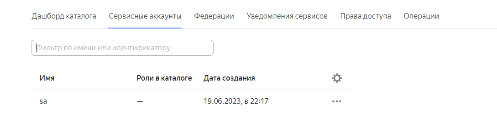
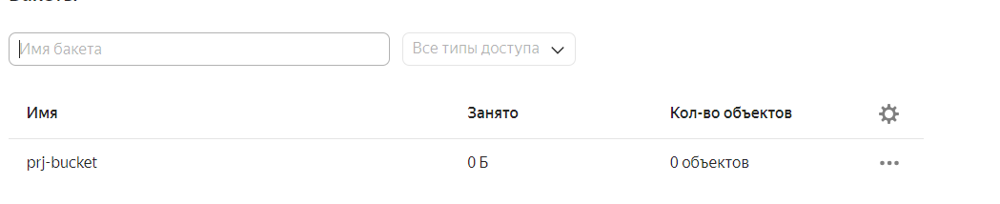
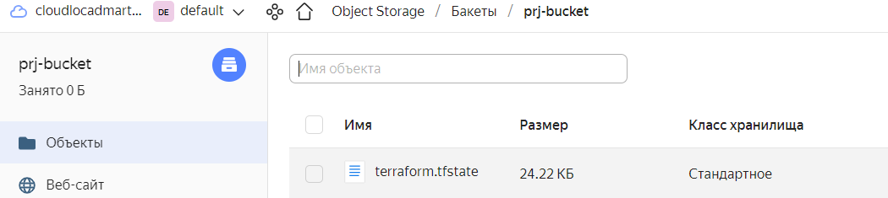
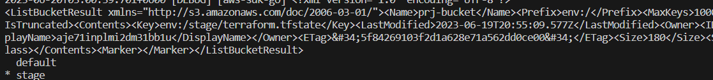
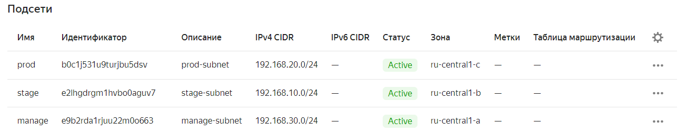
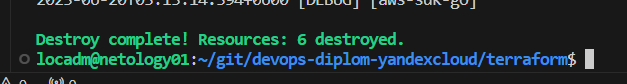
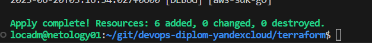

# Дипломный практикум в Yandex.Cloud
  * [Цели:](#цели)
  * [Этапы выполнения:](#этапы-выполнения)
     * [Создание облачной инфраструктуры](#создание-облачной-инфраструктуры)
     * [Создание Kubernetes кластера](#создание-kubernetes-кластера)
     * [Создание тестового приложения](#создание-тестового-приложения)
     * [Подготовка cистемы мониторинга и деплой приложения](#подготовка-cистемы-мониторинга-и-деплой-приложения)
     * [Установка и настройка CI/CD](#установка-и-настройка-cicd)
  * [Что необходимо для сдачи задания?](#что-необходимо-для-сдачи-задания)
  * [Как правильно задавать вопросы дипломному руководителю?](#как-правильно-задавать-вопросы-дипломному-руководителю)

---
## Цели:

1. Подготовить облачную инфраструктуру на базе облачного провайдера Яндекс.Облако.
2. Запустить и сконфигурировать Kubernetes кластер.
3. Установить и настроить систему мониторинга.
4. Настроить и автоматизировать сборку тестового приложения с использованием Docker-контейнеров.
5. Настроить CI для автоматической сборки и тестирования.
6. Настроить CD для автоматического развёртывания приложения.

---

### Решение: 
### Создание облачной инфраструктуры

Для начала необходимо подготовить облачную инфраструктуру в ЯО при помощи [Terraform](https://www.terraform.io/).

Особенности выполнения:

- Бюджет купона ограничен, что следует иметь в виду при проектировании инфраструктуры и использовании ресурсов;
```
Скидок нет, будем накатывать постепенно.
```
- Следует использовать последнюю стабильную версию [Terraform](https://www.terraform.io/).

```
Обновляем terraform
locadm@netology01:~/git$ terraform -version
Terraform v1.5.0
on linux_amd64
```

Предварительная подготовка к установке и запуску Kubernetes кластера.

1. Создайте сервисный аккаунт, который будет в дальнейшем использоваться Terraform для работы с инфраструктурой с необходимыми и достаточными правами. Не стоит использовать права суперпользователя

Создание сервисного аккаунта, права, ключи доступа, создание пустого бакета

[bucket.tf](terraform_adm/bucket.tf)
```
locadm@netology01:~/git/devops-diplom-yandexcloud/terraform_adm$  yc iam service-account list
+----------------------+------+
|          ID          | NAME |
+----------------------+------+
| aje71inplmi2dm31bb1u | sa   |
+----------------------+------+
```
<!--  -->
```
locadm@netology01:~/git/devops-diplom-yandexcloud/terraform_adm$ yc iam access-key list --service-account-name sa
+----------------------+----------------------+---------------------------+
|          ID          |  SERVICE ACCOUNT ID  |          KEY ID           |
+----------------------+----------------------+---------------------------+
| aje3a8o8uj5pus5jr9gb | aje71inplmi2dm31bb1u | YCAJEQIazPRtyh5DchRVzMgg1 |
+----------------------+----------------------+---------------------------+
```

Права на доступ к бакету

[2.PNG](pics/2.PNG)
```
Пустой бакет
locadm@netology01:~/git/devops-diplom-yandexcloud/terraform_adm$ yc storage bucket list
+------------+----------------------+----------+-----------------------+---------------------+
|    NAME    |      FOLDER ID       | MAX SIZE | DEFAULT STORAGE CLASS |     CREATED AT      |
+------------+----------------------+----------+-----------------------+---------------------+
| prj-bucket | b1gkgthf18fqkuii66ht |        0 | STANDARD              | 2023-06-29 19:48:06 |
+------------+----------------------+----------+-----------------------+---------------------+
```

2. Подготовьте [backend](https://www.terraform.io/docs/language/settings/backends/index.html) для Terraform:  
   а. Рекомендуемый вариант: [Terraform Cloud](https://app.terraform.io/)  
   б. Альтернативный вариант: S3 bucket в созданном ЯО аккаунте
```
Идем по s3
Создал backend на базе бакета выше. В бакет сохраняется tfstate.
```
[provider.tf](terraform/provider.tf)

3. Настройте [workspaces](https://www.terraform.io/docs/language/state/workspaces.html)  
   а. Рекомендуемый вариант: создайте два workspace: *stage* и *prod*. В случае выбора этого варианта все последующие шаги должны учитывать факт существования нескольких workspace.  
   б. Альтернативный вариант: используйте один workspace, назвав его *stage*. Пожалуйста, не используйте workspace, создаваемый Terraform-ом по-умолчанию (*default*).
```
Идем по альтернативному пути

Создаем 
terraform workspace new stage

locadm@netology01:~/git/devops-diplom-yandexcloud/terraform$ terraform workspace select stage
...
Switched to workspace "stage".

default
* stage
```

4. Создайте VPC с подсетями в разных зонах доступности.
```
Создадим подсети в разных зонах доступности
locadm@netology01:~/git/devops-diplom-yandexcloud/terraform$ yc vpc network list-subnets network
+----------------------+--------+----------------------+----------------------+----------------+---------------+-------------------+
|          ID          |  NAME  |      FOLDER ID       |      NETWORK ID      | ROUTE TABLE ID |     ZONE      |       RANGE       |
+----------------------+--------+----------------------+----------------------+----------------+---------------+-------------------+
| b0c1j531u9turjbu5dsv | prod   | b1gkgthf18fqkuii66ht | enp1kpenkl1i14jjuple |                | ru-central1-c | [192.168.20.0/24] |
| e2lhgdrgm1hvbo0aguv7 | stage  | b1gkgthf18fqkuii66ht | enp1kpenkl1i14jjuple |                | ru-central1-b | [192.168.10.0/24] |
| e9b2rda1rjuu22m0o663 | manage | b1gkgthf18fqkuii66ht | enp1kpenkl1i14jjuple |                | ru-central1-a | [192.168.30.0/24] |
+----------------------+--------+----------------------+----------------------+----------------+---------------+-------------------+
```
[network.tf](terraform/network.tf)


5. Убедитесь, что теперь вы можете выполнить команды `terraform destroy` и `terraform apply` без дополнительных ручных действий.
```
Удаление объектов
```

```
Создание. Как видно не требует усилий в workspace stage
```


6. В случае использования [Terraform Cloud](https://app.terraform.io/) в качестве [backend](https://www.terraform.io/docs/language/settings/backends/index.html) убедитесь, что применение изменений успешно проходит, используя web-интерфейс Terraform cloud.
```
В случае s3 не предполагается.
```

Ожидаемые результаты:

1. Terraform сконфигурирован и создание инфраструктуры посредством Terraform возможно без дополнительных ручных действий.
2. Полученная конфигурация инфраструктуры является предварительной, поэтому в ходе дальнейшего выполнения задания возможны изменения.

---
### Создание Kubernetes кластера
https://internet-lab.ru/k8s_kubespray

```
https://github.com/kubernetes-sigs/kubespray

declare -a IPS=(192.168.10.21 192.168.10.32 192.168.10.35)
CONFIG_FILE=./kubespray/inventory/mycluster/hosts.yaml python3 ~/kubespray/contrib/inventory_builder/inventory.py ${IPS[@]}


ansible-playbook -i ./.ansible/inventory.ini kuberspray.yaml
```

```
Sunday 25 June 2023  20:39:06 +0000 (0:00:00.145)       0:15:56.505 *********** 
=============================================================================== 
kubernetes/preinstall : Install packages requirements ------------------------------------------------------------- 37.71s
network_plugin/calico : Wait for calico kubeconfig to be created -------------------------------------------------- 22.68s
kubernetes/control-plane : Master | wait for kube-scheduler ------------------------------------------------------- 21.07s
kubernetes/control-plane : kubeadm | Initialize first master ------------------------------------------------------ 19.68s
kubernetes/kubeadm : Join to cluster ------------------------------------------------------------------------------ 16.86s
kubernetes/preinstall : Update package management cache (APT) ----------------------------------------------------- 15.04s
kubernetes-apps/ansible : Kubernetes Apps | Start Resources ------------------------------------------------------- 12.60s
download : download_container | Download image if required -------------------------------------------------------- 11.76s
kubernetes-apps/ansible : Kubernetes Apps | Lay Down CoreDNS templates -------------------------------------------- 11.28s
download : download_container | Download image if required -------------------------------------------------------- 10.11s
download : download_container | Download image if required --------------------------------------------------------- 9.87s
kubernetes/preinstall : Preinstall | wait for the apiserver to be running ------------------------------------------ 7.78s
network_plugin/calico : Start Calico resources --------------------------------------------------------------------- 7.12s
container-engine/containerd : containerd | Unpack containerd archive ----------------------------------------------- 6.81s
etcd : reload etcd ------------------------------------------------------------------------------------------------- 6.68s
download : download_file | Download item --------------------------------------------------------------------------- 6.68s
download : download_container | Download image if required --------------------------------------------------------- 6.43s
network_plugin/calico : Calico | Create calico manifests ----------------------------------------------------------- 6.33s
container-engine/containerd : download_file | Download item -------------------------------------------------------- 6.27s
container-engine/crictl : extract_file | Unpacking archive --------------------------------------------------------- 6.09s
```
```
ansible-playbook ~/kubespray/cluster.yml -i ~/kubespray/inventory/mycluster/inventory.ini --diff
```


```
root@stage-master:~/kubespray# kubectl get pods --all-namespaces
NAMESPACE     NAME                                      READY   STATUS    RESTARTS        AGE
kube-system   calico-kube-controllers-6dfcdfb99-whhl6   1/1     Running   0               5m
kube-system   calico-node-6j92v                         1/1     Running   0               5m55s
kube-system   calico-node-d6q2t                         1/1     Running   0               5m55s
kube-system   calico-node-nm89p                         1/1     Running   0               5m55s
kube-system   coredns-645b46f4b6-w6qtk                  1/1     Running   0               4m27s
kube-system   coredns-645b46f4b6-x9jgc                  1/1     Running   0               4m34s
kube-system   dns-autoscaler-659b8c48cb-78lj2           1/1     Running   0               4m29s
kube-system   kube-apiserver-node1                      1/1     Running   1               7m57s
kube-system   kube-controller-manager-node1             1/1     Running   2               7m58s
kube-system   kube-proxy-677kv                          1/1     Running   0               6m38s
kube-system   kube-proxy-7lzjt                          1/1     Running   0               6m38s
kube-system   kube-proxy-qlvt4                          1/1     Running   0               6m38s
kube-system   kube-scheduler-node1                      1/1     Running   2 (7m32s ago)   7m55s
kube-system   nginx-proxy-node2                         1/1     Running   0               5m35s
kube-system   nginx-proxy-node3                         1/1     Running   0               5m37s
kube-system   nodelocaldns-c6tf5                        1/1     Running   0               4m26s
kube-system   nodelocaldns-r7s8c                        1/1     Running   0               4m26s
kube-system   nodelocaldns-zvl62                        1/1     Running   0               4m26s
```

На этом этапе необходимо создать [Kubernetes](https://kubernetes.io/ru/docs/concepts/overview/what-is-kubernetes/) кластер на базе предварительно созданной инфраструктуры.   Требуется обеспечить доступ к ресурсам из Интернета.

Это можно сделать двумя способами:

1. Рекомендуемый вариант: самостоятельная установка Kubernetes кластера.  
   а. При помощи Terraform подготовить как минимум 3 виртуальных машины Compute Cloud для создания Kubernetes-кластера. Тип виртуальной машины следует выбрать самостоятельно с учётом требовании к производительности и стоимости. Если в дальнейшем поймете, что необходимо сменить тип инстанса, используйте Terraform для внесения изменений.  
   ```

   ```   
   б. Подготовить [ansible](https://www.ansible.com/) конфигурации, можно воспользоваться, например [Kubespray](https://kubernetes.io/docs/setup/production-environment/tools/kubespray/)  
   в. Задеплоить Kubernetes на подготовленные ранее инстансы, в случае нехватки каких-либо ресурсов вы всегда можете создать их при помощи Terraform.

2. Альтернативный вариант: воспользуйтесь сервисом [Yandex Managed Service for Kubernetes](https://cloud.yandex.ru/services/managed-kubernetes)  
  а. С помощью terraform resource для [kubernetes](https://registry.terraform.io/providers/yandex-cloud/yandex/latest/docs/resources/kubernetes_cluster) создать региональный мастер kubernetes с размещением нод в разных 3 подсетях      
  б. С помощью terraform resource для [kubernetes node group](https://registry.terraform.io/providers/yandex-cloud/yandex/latest/docs/resources/kubernetes_node_group)
  
Ожидаемый результат:

1. Работоспособный Kubernetes кластер.
2. В файле `~/.kube/config` находятся данные для доступа к кластеру.
3. Команда `kubectl get pods --all-namespaces` отрабатывает без ошибок.

---
Прерываемая машина   

scheduling_policy {
    preemptible = true
}

